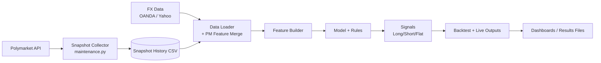
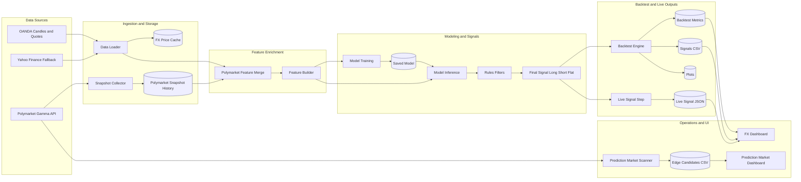

# FX ML Trading System — EUR/USD

A practical FX ML pipeline for EUR/USD with backtesting, walk-forward validation,
live signal generation, and optional Polymarket-derived macro sentiment features.

## At a Glance

- **Primary goal**: Generate disciplined Long/Short/Flat FX signals with risk controls.
- **Core stack**: OANDA/Yahoo data → feature engineering → ML probabilities → rules filters → backtest/live outputs.
- **New integration**: Optional Polymarket snapshot feed merged leak-safely into FX bars.
- **Dashboards**: FX operations dashboard plus prediction-market edge scanner dashboard.

## Quick Start

```bash
pip install -r requirements.txt
python main.py --mode train --profile balanced --refresh-data
python main.py --mode backtest --profile balanced --refresh-data
python main.py --mode live --profile balanced --refresh-data
```

Open dashboards:

```bash
streamlit run dashboard.py
python -m streamlit run polymarket_dashboard.py --server.port 8503
```

## Repository Guide

- **Runbook**: [Typical Daily Workflow](#typical-daily-workflow), [Typical Weekly Workflow](#typical-weekly-workflow), [Typical Monthly Workflow](#typical-monthly-workflow)
- **Architecture**: [Architecture (with Polymarket integration)](#architecture-with-polymarket-integration)
- **Usage commands**: [Usage](#usage)
- **PM maintenance**: [FX + Polymarket feature MVP](#fx--polymarket-feature-mvp)

---

## System Architecture

```
fx_trading_system/
├── config.py          ← All tunable parameters in one place
├── data_loader.py     ← Downloads & caches EUR/USD OHLCV data (yfinance)
├── features.py        ← Technical indicator computation & feature engineering
├── model.py           ← ML model (Random Forest / GBM / XGBoost)
├── signals.py         ← Rules-based filter stack on top of ML probabilities
├── backtest.py        ← Event-driven backtester + performance metrics
├── walk_forward.py    ← Rolling walk-forward OOS validation engine
├── visualization.py   ← All charts and plots
├── main.py            ← Pipeline orchestrator / CLI entry point
├── requirements.txt   ← Python dependencies
└── README.md
```

### Architecture (with Polymarket integration)

#### Quick view



Legend:
- **Scheduled**: `maintenance.py --collect` (and optional `--cleanup`) updates snapshot history.
- **On-demand**: `main.py` train/backtest/live runs consume latest snapshot history via leak-safe merge.
- **Optional UI path**: `polymarket_edge.py` and `polymarket_dashboard.py` are independent research tools.

#### Typical Daily Workflow
1. Run maintenance (or rely on scheduled task): `python maintenance.py --collect --cleanup --interval 1h --keep-days 90 --quiet`
2. Generate latest actionable FX signal: `python main.py --mode live --profile balanced --refresh-data`
3. Review outputs in `results/live_signal_latest.json` and `results/signals_latest.csv` (or `dashboard.py`).

#### Typical Weekly Workflow
1. Retrain model with latest data and PM snapshots: `python main.py --mode train --profile balanced --refresh-data`
2. Run OOS backtest sanity check: `python main.py --mode backtest --profile balanced --refresh-data`
3. Run walk-forward validation: `python main.py --mode walkforward --profile balanced --refresh-data`
4. Review artifacts in `results/backtest_metrics.json`, `results/walk_forward_metrics.json`, and `plots/`.

#### Typical Monthly Workflow
1. Re-run threshold sweep for robustness: `python threshold_sweep.py --quick --min-valid-folds 2`
2. Compare profile behavior on fresh data:
    - `python main.py --mode walkforward --profile safe --refresh-data`
    - `python main.py --mode walkforward --profile balanced --refresh-data`
    - `python main.py --mode walkforward --profile aggressive --refresh-data`
3. Promote/keep profile based on stability (drawdown + trade count + consistency), not just raw return.



### Data Flow

```
yfinance / Cache
      │
      ▼
  OHLCV Data
      │
      ▼
Feature Engineering ──────────────────────────────────────┐
  (50+ technical indicators)                              │
      │                                                   │
      ▼                                                   ▼
  ML Model Training                            Rules-Based Filters
  (RandomForest / GBM / XGBoost)               ├── Trend Filter (SMA200)
      │                                        ├── Volatility Filter (ATR)
      ▼                                        ├── RSI Filter
  Signal Probabilities                         ├── Regime Filter (ADX)
  [prob_long, prob_flat, prob_short]           └── Trade Cooldown
           │                                            │
           └──────────────────┬─────────────────────────┘
                              ▼
                     Final Trading Signal
                     (+1 Long / -1 Short / 0 Flat)
                              │
                              ▼
                    Backtesting Engine
                    (ATR Stop-Loss + Take-Profit)
                              │
                              ▼
                  Performance Metrics & Charts
```

---

## Installation

```bash
cd fx_trading_system
pip install -r requirements.txt
```

For XGBoost support:
```bash
pip install xgboost
```

---

## Usage

### Full Pipeline (recommended first run)
```bash
python main.py
```
This runs: data download → model training → OOS backtest → walk-forward analysis.

### Skip Walk-Forward (faster, for quick testing)
```bash
python main.py --no-wf
```

### Individual steps
```bash
python main.py --mode train        # Train and save model only
python main.py --mode backtest     # Run OOS backtest (loads saved model)
python main.py --mode walkforward  # Walk-forward analysis only
python main.py --mode report       # Regenerate charts from saved results
python main.py --mode journal      # Create today's paper-trading journal file
python main.py --mode live --profile balanced --refresh-data  # Latest intraday live signal only
python main.py --mode walkforward --refresh-data  # Force fresh market data pull
python main.py --mode walkforward --profile safe --refresh-data
python main.py --mode walkforward --profile balanced --refresh-data
python main.py --mode walkforward --profile aggressive --refresh-data
python threshold_sweep.py --quick  # Fast threshold tuning sweep
python threshold_sweep.py --quick --min-valid-folds 2  # Ignore weak 1-fold configs
streamlit run dashboard.py
python polymarket_edge.py --provider polymarket --top 20
python polymarket_edge.py --provider kalshi --top 20
python -m streamlit run polymarket_dashboard.py --server.port 8503
```

### Prediction market edge scanner
Scan active Polymarket or Kalshi markets and rank potential edge candidates.

```bash
python polymarket_edge.py --provider polymarket --top 25 --max-markets 500
python polymarket_edge.py --provider kalshi --top 25 --max-markets 500
python polymarket_edge.py --provider polymarket --top 25 --fee-bps-round-trip 120 --min-liquidity 2500
python polymarket_edge.py --provider polymarket --top 25 --max-fair-deviation-bps 300
python polymarket_edge.py --provider polymarket --top 25 --max-edge-bps 400
python polymarket_edge.py --provider polymarket --priors-csv results/polymarket_priors.csv --top 25
```

Output:
- `results/polymarket_edge_candidates.csv` or `results/kalshi_edge_candidates.csv`
- `results/polymarket_watchlist_log.csv` or `results/kalshi_watchlist_log.csv` (from dashboard "Save daily watchlist")

Dashboard note:
- In `polymarket_dashboard.py`, when provider is `kalshi`, the **Use looser Kalshi preset** button enables a discovery mode (higher recall, lower precision).

Optional custom priors CSV format (`market_id,fair_yes_prob`):

```csv
market_id,fair_yes_prob
517310,0.41
517311,0.62
```

Notes:
- Default ranking uses a transparent heuristic (mean-reversion on short-term moves + liquidity shrink).
- This is research tooling, not guaranteed alpha.

### Intraday live mode (1h)
Use this when you want the most recent actionable signal without running a full backtest:

```bash
python main.py --mode live --profile balanced --refresh-data
```

This writes `results/live_signal_latest.json`, which the dashboard reads in the
`Live Inference Signal` and `Data Freshness` sections.

Note: for `1h` data, the loader automatically clamps the start date to Yahoo's
recent-history limit to avoid empty downloads.

### FX + Polymarket feature MVP
The FX pipeline can now ingest lightweight Polymarket cross-sectional sentiment features
as optional model inputs.

- Config block: `PREDICTION_MARKET_CONFIG` in `config.py`
- Snapshot artifact: `data/polymarket_macro_snapshots.csv`
- Merge behavior: leak-safe backward as-of join onto FX bars with neutral fallback values

Current derived features include:
- `pm_yes_mid_mean`, `pm_yes_mid_std`
- `pm_change_1h_mean`, `pm_change_24h_mean`
- `pm_spread_mean_bps`, `pm_liquidity_median`, `pm_volume_median`
- `pm_sample_count`, `pm_active_ratio`, `pm_snapshot_age_hours`, `pm_data_available`

To build history continuously (recommended), run the standalone collector hourly:

```bash
python collect_polymarket_snapshot.py --interval 1h
```

Windows Task Scheduler (hourly example):

```powershell
schtasks /Create /SC HOURLY /MO 1 /TN "FX_Polymarket_Snapshot" /TR "C:\Projects\fx-claude\.venv\Scripts\python.exe C:\Projects\fx-claude\collect_polymarket_snapshot.py --interval 1h" /F
```

Clean/deduplicate snapshot history (keep latest 90 days):

```bash
python cleanup_polymarket_snapshots.py --keep-days 90
```

Optional weekly cleanup task (Sunday 03:00):

```powershell
schtasks /Create /SC WEEKLY /D SUN /ST 03:00 /TN "FX_Polymarket_Snapshot_Cleanup" /TR "C:\Projects\fx-claude\.venv\Scripts\python.exe C:\Projects\fx-claude\cleanup_polymarket_snapshots.py --keep-days 90" /F
```

Unified maintenance script (single entrypoint):

```bash
python maintenance.py --collect
python maintenance.py --cleanup --keep-days 90
python maintenance.py --collect --cleanup --interval 1h --keep-days 90
python maintenance.py --collect --cleanup --interval 1h --keep-days 90 --quiet
```

Single scheduled task example (collect + cleanup each hour):

```powershell
schtasks /Create /SC HOURLY /MO 1 /TN "FX_PM_Maintenance" /TR "C:\Projects\fx-claude\.venv\Scripts\python.exe C:\Projects\fx-claude\maintenance.py --collect --cleanup --interval 1h --keep-days 90" /F
```

After enough snapshot history is collected, retrain to let the model learn from `pm_*` features:

```bash
python main.py --mode train --profile balanced --refresh-data
```

### OANDA data provider (closer to realtime)
You can switch market data from Yahoo to OANDA candles.

1. Set your OANDA token (PowerShell):
    - `$env:OANDA_API_KEY = "YOUR_TOKEN_HERE"`
2. In `config.py`, set:
    - `DATA_CONFIG["provider"] = "oanda"`
    - `DATA_CONFIG["oanda_environment"] = "practice"` (or `"live"`)
    - `DATA_CONFIG["oanda_instrument"] = "EUR_USD"`
3. Run live mode:
    - `python main.py --mode live --profile balanced --refresh-data`

OANDA supports candle data only (not tick-by-tick in this implementation), but
it is typically fresher and more execution-aligned than Yahoo.

### Practical day-to-day workflow
1. Refresh signals for your chosen profile:
    - `python main.py --mode backtest --profile balanced --refresh-data`
2. Open the dashboard:
    - `streamlit run dashboard.py`
3. Read the latest signal from `Current Signal`:
    - `signal_label=Long` or `Short` with `signal_reason=PASS` = actionable model signal
    - `signal_label=Flat` = no trade
4. Confirm profile quality in `Walk-Forward Snapshot` and `Gate Status` before live action.

### Where to read signals directly (without dashboard)
- `results/signals_latest.csv`
- Latest row gives current state; key columns:
  - `signal_label` (`Long`, `Short`, `Flat`)
  - `signal_reason` (`PASS` or block reason)
  - `prob_long`, `prob_short`, `prob_flat`

### Deployment gate (GO / NO-GO)
```bash
python deployment_gate.py
```
Uses `results/walk_forward_metrics.json` and prints a hard/soft checklist plus
one of:
- `GO_PAPER_AND_PREPARE_LIVE`
- `GO_PAPER_WITH_CAUTION`
- `NO_GO`

Optional:
```bash
python deployment_gate.py --json
python deployment_gate.py --metrics-path results/walk_forward_metrics.json
```

---

## Key Configuration (`config.py`)

### Choosing the ML Model
```python
MODEL_CONFIG = {
    "model_type": "random_forest",   # ← change to "gradient_boost" or "xgboost"
    "min_confidence": 0.35,          # ← minimum directional confidence
    "min_edge_over_opposite": 0.003, # ← directional edge vs opposite class
    "min_edge_over_flat": -1.0,      # ← disable flat-edge gate by default
}

# Profile presets (one-flag switch)
#   --profile safe       -> min_confidence=0.335, adx=18
#   --profile balanced   -> min_confidence=0.34,  edge=0.008, adx=16
#   --profile aggressive -> min_confidence=0.34,  adx=20
```

### Adjusting the Date Range
```python
DATA_CONFIG = {
    "train_start": "2018-01-01",
    "train_end":   "2025-07-31",
    "test_start":  "2025-08-01",
    "test_end":    "auto",           # ← uses today's date
    "interval":    "1h",             # ← intraday default (recent-history window)
}
```

### Risk Management
```python
RISK_CONFIG = {
    "initial_capital":      100_000,
    "risk_per_trade_pct":   1.0,     # ← % of capital risked per trade
    "atr_stop_multiplier":  1.5,     # ← stop distance = 1.5 × ATR
    "take_profit_multiplier": 2.0,   # ← TP = 2.0 × ATR (1:2 risk/reward)
    "trading_fee_bps_per_side": 1.5, # ← fee charged on entry and exit
    "max_drawdown_pct":     15.0,    # ← halt trading beyond this DD
}
```

### Walk-Forward Parameters
```python
WALK_FORWARD_CONFIG = {
    "train_window_bars": 400,    # ← compact train window for recent-only datasets
    "test_window_bars":  120,    # ← ~6 months OOS on daily bars
    "step_size_bars":    60,     # ← overlap folds for smoother stats
}
```

### Enabling/Disabling Rules Filters
```python
RULES_CONFIG = {
    "trend_filter_enabled":      True,
    "volatility_filter_enabled": True,
    "rsi_filter_enabled":        True,
    "regime_filter_enabled":     True,   # ADX trending-market check
}
```

---

## Features Computed

| Category       | Indicators                                          |
|---------------|------------------------------------------------------|
| Trend         | SMA(10,20,50,200), EMA(12,26), MA crossovers         |
| Momentum      | RSI(14), MACD(12,26,9), Stochastic(14,3), CCI(20), Williams%R |
| Volatility    | Bollinger Bands(20,2), ATR(14), BB Width, BB Position |
| Volume        | OBV, OBV EMA trend                                   |
| Regime        | ADX(14), trend strength flag                         |
| Lagged Returns| 1, 2, 3, 5, 10 bar returns                          |
| Price Position| High/low range position (5, 10, 20 bar)             |
| Time          | Hour of day, day of week, London/NY/overlap sessions |

---

## Output Files

```
data/           ← Cached OHLCV parquet files
models/         ← Saved trained model (fx_model.pkl)
results/
  ├── backtest_metrics.json
  ├── walk_forward_metrics.json
  └── pipeline.log
plots/
  ├── oos_equity_curve.png      ← Equity + drawdown
  ├── oos_price_signals.png     ← Price chart with signals overlaid
  ├── trade_distribution.png   ← P&L histogram + MAE/MFE scatter
  ├── walk_forward.png          ← Combined OOS equity + per-fold stats
  └── feature_importance.png   ← Top features averaged across WF folds
```

---

## Extending the System

### Add a new technical indicator
1. Implement the indicator function in `features.py`
2. Add it to the `build_features()` function

### Add a new filter rule
1. Add a configuration key to `RULES_CONFIG` in `config.py`
2. Add a `_apply_xxx_filter()` method to `SignalGenerator` in `signals.py`
3. Call it in `SignalGenerator.generate()`

### Trade a different currency pair
Change `DATA_CONFIG["symbol"]` in `config.py`:
```python
"symbol": "GBPUSD=X"   # or "USDJPY=X", "AUDUSD=X", etc.
```

### Use live paper trading
After generating signals, consume `signals_df["signal"]` in your broker's
API (Interactive Brokers, OANDA, etc.). The signal generator can be run
incrementally on real-time bars.

---

## Important Disclaimers

- **This system is for educational and research purposes only.**
- Past backtested performance does not guarantee future results.
- Walk-forward OOS results reduce but do not eliminate overfitting risk.
- Always forward-test on a demo/paper account before risking real capital.
- FX trading involves substantial risk of loss.
